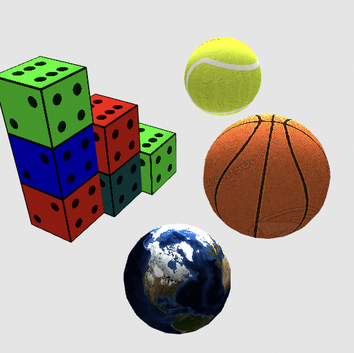

# 3D Volume Modeling

# Project Overview

This project focuses on creating and rendering 3D models using triangle meshes, implementing advanced techniques for shading, texturing, and geometric transformations. The system allows the definition of 3D primitives such as unit cubes and unit spheres, with the cube represented as a "triangle soup" and the sphere generated using stacks and sectors in spherical coordinates to produce a smooth surface. Both primitives use indexed triangle mesh representation, with accurate vertex positions, normals, UV coordinates, and indices for efficient rendering.

Geometric transformations, including translation, rotation (around specified axes), and scaling, are applied to position and manipulate the objects within the scene. Shading is implemented using the Phong reflection model, combining ambient, diffuse (Lambertian), and specular components. Material properties, such as ambient (`ka`), diffuse (`kd`), specular (`ks`) coefficients, and specular shininess, control the visual appearance of the objects. 

Texturing enhances realism by using interpolated UV coordinates and a texture sampler in the fragment shader. If a material includes a texture, the Blinn-Phong shaded color is modulated with the sampled texture color. The scene is illuminated with a single point light, defined by its position and RGB intensity, and viewed through a perspective camera specified by position, look-at direction, and up vector. The rendering pipeline dynamically updates based on the user's inputs, allowing iterative refinement of the 3D scene.