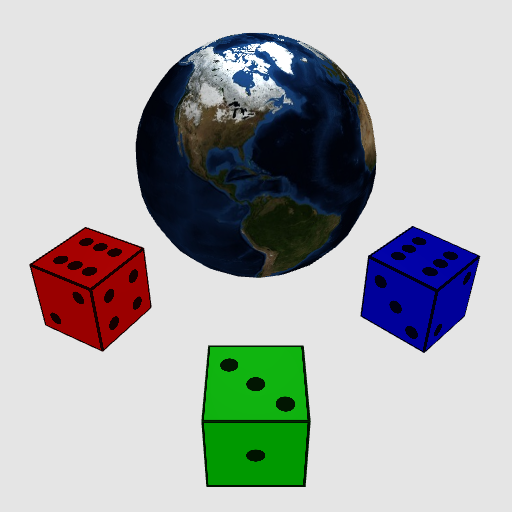

# Introduction to Computer Graphics and Computer Vision Assignment

Implementing shading, texturing and transformations for triangle meshes

# Implementation instructions

Use the following syntax to specify what to render:
- `p,id,cube;` creates a unit cube mesh and gives it the name `id`
- `p,id,sphere,i,j`	creates a unit sphere mesh with name `id`, formed using `i` "stacks", and `j` "sectors"
- `m,id,ka,kd,ks,shininess,texture;` creates a Phong shader material named by `id`, with ambient (`ka`), diffuse (`kd`), specular (`ks`), and specular exponent (`shininess`) coefficients, and an optional texture image specified by `texture`.
- `X,id,T,x,y,z;` specifies a transformation that translates object `id` by `(x,y,z)`.
- `X,id,R?,theta;` specifies a rotation of object `id` around axis `?` (i.e. `Rx` rotates around `x` etc.), by counter-clockwise angle in degrees `theta`.
- `X,id,S,x,y,z;` specifies a scale transformation of object `id` by scale factors `(x,y,z)` along each axis.
- `o,id,prim,mat;` adds an object to the scene with name `id`. The object uses the primitive mesh with id matching `prim` and the Phong shader material with id matching `mat`. Note this is the way to actually add an object into the scene (i.e. primitives and materials are not part of the scene until they are used by an object).
- `l,id,type,x,y,z,ir,ig,ib;` sets the light (with name `id`) and light type `type` at position `(x,y,z)` with intensity `(ir,ig,ib)`. We only support a single light of type `point`.
- `c,id,type,ex,ey,ez,lx,ly,lz,ux,uy,uz;` sets the camera to be placed at position `(ex,ey,ez)` and looking towards `(lx,ly,lz)` with up axis `(ux,uy,uz)`. We only support a single camera of type `perspective`.

The contents of the text box can be changed to define new primitives, materials, and objects that use them, as well as to change the light and camera parameters.
Clicking the "Update" button will refresh the image output.

## Triangle Mesh Generation 

First, implement the unit cube and unit sphere triangle mesh creation logic in `createCube` and `createSphere` respectively.
To do this you will populate the `positions`, `normals`, `uvCoords`, and `indices` members of the `TriangleMesh` within each of these two functions (creating an indexed triangle mesh, i.e. "vertex list" + "index list" representation).
The unit cube should have bottom-left-front corner `-1,-1,+1` and top-right-back corner `+1,+1,-1`.
For the cube, use a "triangle soup" encoding (i.e. repeat vertices that are shared at corners of the cube, and leave the `indices` unpopulated).
The surface normals at each vertex of the cube should point in the direction of the cube's face surface normal.
The unit sphere should be centered at the origin and have radius equal to `1`.
Use the "stacks and sectors" approach to create a triangle mesh sphere using spherical coordinates.
For the sphere, the surface normals at vertices should point outwards from the center of the sphere.

## Transformations 

Now, implement transformations to position your triangle meshes.

## Shading 

Iimplement the ambient and Lambertian components of Phong shading (using the `ka` and `kd` coefficients).
Then, implement and add the specular component (using the `ks` and `shininess` coefficients).

## Texturing 

Finally, implement texturing by using the interpolated texture coordinates (`vTexCoord`) and the texture sampler (`uTexture`) in the fragment shader.
If the material specifies a texture, modulate the color from Blinn-Phong shading by the texture color (i.e. multiply the shaded color and the texture color).